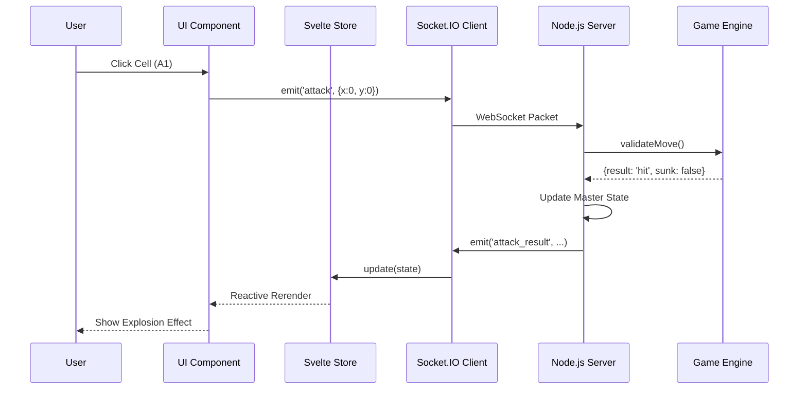

# Data Flow

This document describes how data and events flow through the Battleship system, from user interaction to server validation and global synchronization.

## 1. Overview of the Flow

The system follows a **Unidirectional Data Flow** combined with a **Server-Authoritative** networking model.

1. **User Action**: Player interacts with the UI (e.g., clicks a cell to attack).
2. **Intent Emission**: The client emits a Socket.IO event (e.g., `attack`).
3. **Server Validation**: The Node.js server receives the event, validates the player's turn, and runs the Game Engine logic.
4. **State Update**: If valid, the server updates the master game state in memory.
5. **Broadcast**: The server broadcasts the *result* or *delta* to all clients in the room.
6. **Reactive Sync**: Clients receive the event and update their local Svelte stores, triggering a UI rerender.

## 2. Component Interaction Flow

## 3. Data Flow Patterns

### Ship Placement
During the placement phase, data flows primarily between the **ShipPlacementPanel** and a local **PlacementStore**. Only once the player clicks "Ready" is the final layout sent to the server for authoritative validation.

### Turn Synchronization
The `turn_changed` event is the primary driver for the game loop. 
- When a turn changes, the client-side `gameStore` updates.
- This automatically enables/disables the `EnemyBoard` component's interactivity.

### Error Handling Flow
If a player attempts an invalid action (e.g., attacking twice), the server emits an `error` event. The client-side `uiStore` catches this and displays a toast message to the user, ensuring the local state doesn't diverge from the server.
