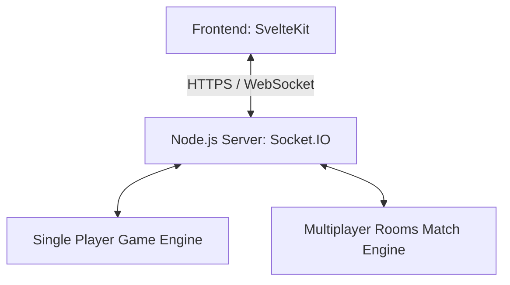

# System Architecture Overview

This document provides a high-level overview of the Battleship Web Game's architecture, core principles, and technical foundation.

## 1. System Diagram

## 2. Architectural Principles

To ensure a robust and maintainable game, we adhere to the following core principles:

- **Server Authoritative Multiplayer**: The server is the ultimate source of truth for game state, turn validation, attack resolution, and win conditions. Clients are responsible for rendering the UI and sending user intents.
- **Shared Game Engine**: A single, pure-logic game engine is used for single-player, multiplayer, AI, and testing. This ensures consistent behavior across all game modes.
- **UI Decoupled from Logic**: Frontend components are "dumb" and only render the state provided by the engine/store. Game rules and logic are never implemented directly within UI components.

## 3. Technology Stack

The project uses a modern, performant stack optimized for SvelteKit and real-time communication.

### Frontend
- **Framework**: [SvelteKit](https://kit.svelte.dev/)
- **Styling**: [Tailwind CSS](https://tailwindcss.com/)
- **State Management**: [Svelte Stores](https://svelte.dev/tutorial/writable-stores)
- **Animation**: Native Svelte transitions (fade, scale, flip). 
- **Drag & Drop**: [svelte-dnd-action](https://github.com/isaacHagoel/svelte-dnd-action)
- **Audio**: [howler.js](https://howlerjs.com/)
- **Language**: TypeScript

### Backend
- **Runtime**: Node.js
- **Real-time Communication**: [Socket.IO](https://socket.io/)
- **Language**: TypeScript

### Testing
- **Framework**: [Vitest](https://vitest.dev/)

### Deployment
- **Frontend**: Vercel
- **Backend**: Railway

> **Note on Library Selections**: We have explicitly opted for Svelte-native or framework-agnostic libraries. React-specific libraries like `dnd-kit`, `Framer Motion`, and `Zustand` are not included in the stack.

## 4. MVP Scope & Scalability

### Phase 1: MVP (Must Have)
- ✅ Single-player with AI opponent.
- ✅ Multiplayer rooms with real-time attacks.
- ✅ Ship placement validation.
- ✅ Audio and animation effects.
- ✅ Responsive, mobile-friendly UI.

### Future Phases (Scalability Plan)
- **Phase 2**: Online matchmaking and persistent player profiles.
- **Phase 3**: Global rankings and leaderboards.
- **Phase 4**: Competitive features (tournaments, replay system).
- **Phase 5**: Social features (chat, friends list, cosmetics).

*Initially, we avoid complex features like chat, ranked matchmaking, and persistence databases to focus on a polished core experience.*
